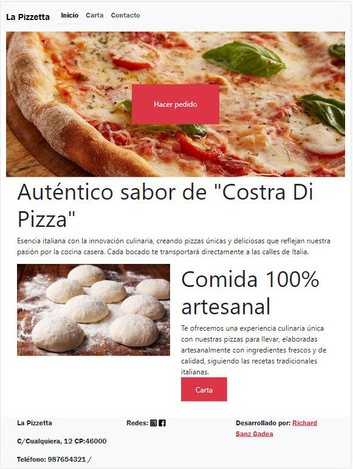
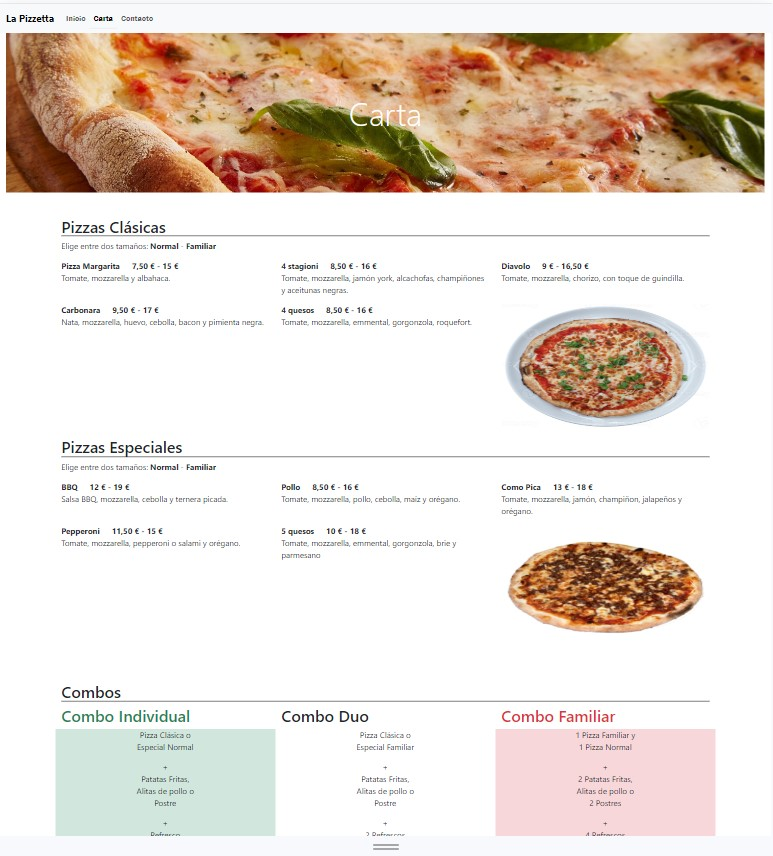
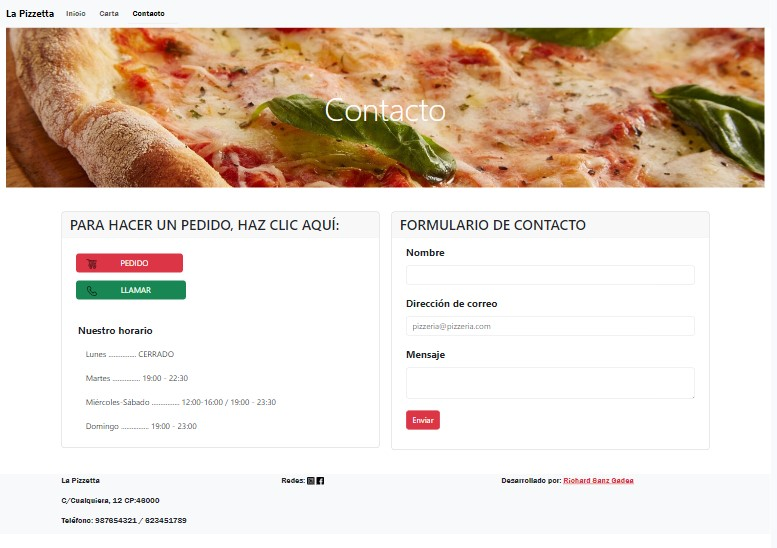

# La Pizzetta

# Simulación de Pizzería

Bienvenidos a La Pizzeta, tu pizzería 100% artesana con productos frescos y de buena calidad. Te transportará a las calles de Italia. 


## Proyecto
Este proyecto está centrado en el diseño responsive. Consta de tres páginas html hipervinculadas (Inicio,Carta,Contacto) del establecimiento de restauración.

## Tecnologías utilizadas


## Características principales

* **Menú**: Nuestra carta presenta una variedad de pizzas, todas elaboradas con productos italianos.
* **Accesible en línea**: Puedes explorar la carta, consultar nuestro horario y formulario para poneros en contacto con nostros.

## Uso   
1. **Página de inicio**: Encontrarás una breve introducción y los apartados a los que podrás acceder.
2. **Exploración del menú**: Podrás navegar por nuestro menú virtual.
3. **Página de contacto**: Consulta nuestro horario y como contactar.

## Capturas de pantalla




## Funcionalidades a desarrollar en un futuro
* **Formulario**: ponerse en contacto con la pizzería por correo.
* **Hacer Pedido Online**: poder hacer un pedido desde la web y que la pizzería reciba esa petición.
* **Llamar al establecimiento**: al pulsar, llamar automáticamente al local desde dispositivos móviles.

## Contribuciones
Si alguien desea contribuir en el desarrollo de La Pizzetta, puede ponerse en contacto con nosotros en richardsgadea@gmal.com o le invitamos a abrir un [Issue](https://github.com/RichardSGadea/LaPizzetta/issues) o enviar una [Pull request](https://github.com/RichardSGadea/LaPizzetta/pulls)

## Implementación de este repositorio
1. Descargaremos Git con la versión que deseemos (https://git-scm.com/)
2. Nos crearemos desde la consola un directorio en el que alojaremos el clone de este repositorio, luego entraremos dentro del repositorio creado
   ```
   mkdir directorioNuevo
   ```
   ```
   cd directorioNuevo
   ```
3. Y dentro de esta carpeta en consola pondríamos el siguiente comando
   ```
   https://github.com/RichardSGadea/LaPizzetta.git
   ```
